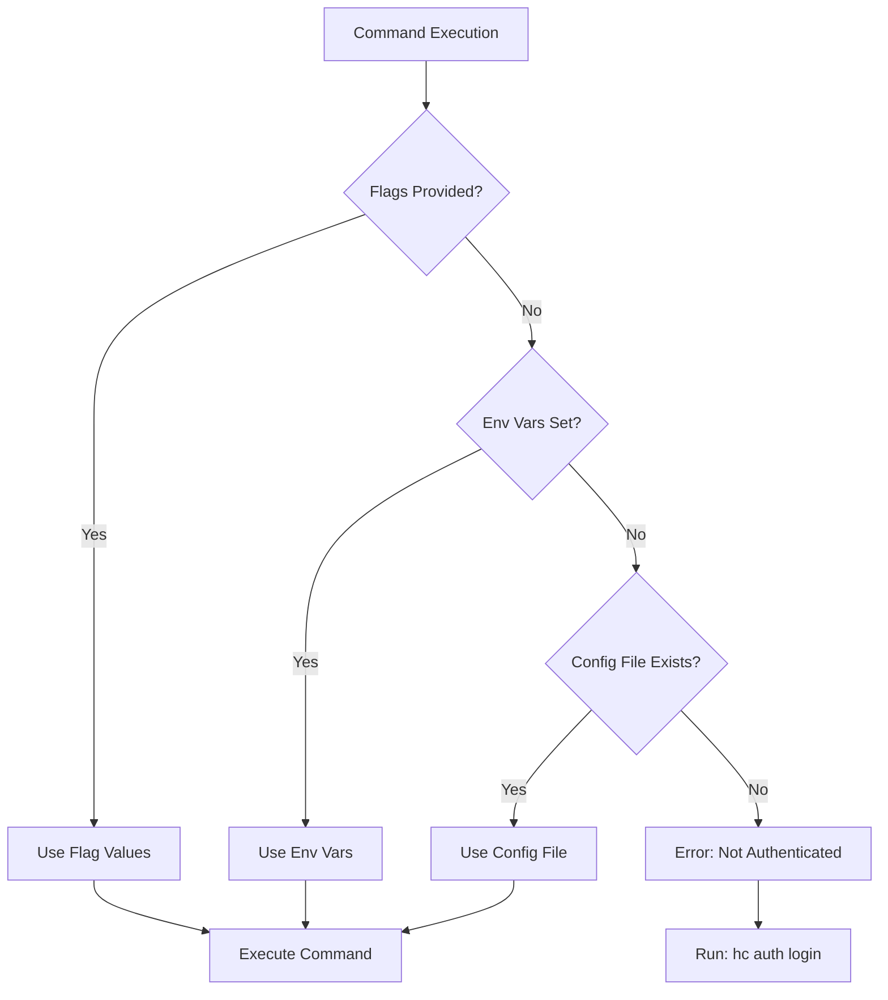

Harness CLI uses API tokens to authenticate with Harness services. Authentication credentials are stored locally and used for all subsequent commands.

## Authentication Methods

The CLI supports three ways to provide authentication credentials, in order of precedence:

<Steps>
  <Step title="Command-line flags">
    Flags override all other configuration sources
  </Step>
  <Step title="Environment variables">
    Environment variables override the config file
  </Step>
  <Step title="Configuration file">
    Stored credentials from `hc auth login`
  </Step>
</Steps>

## Configuration File

When you run `hc auth login`, credentials are saved to `~/.harness/auth.json`:

```json
{
  "base_url": "https://app.harness.io",
  "token": "pat.account_id.random.random",
  "account_id": "your_account_id",
  "org_id": "optional_org_id",
  "project_id": "optional_project_id"
}
```

<Note>
  The config file is created with `0600` permissions (read/write for owner only) to protect your credentials.
</Note>

## Authentication Commands

### Login

Authenticate with Harness and save credentials:

<CodeGroup>
```bash Interactive Mode
# Prompts for all required information
hc auth login
```

```bash Non-Interactive Mode
# Provide all credentials via flags
hc auth login \
  --api-url https://app.harness.io \
  --api-token pat.account.xxx.xxx \
  --account my_account_id \
  --org my_org \
  --project my_project \
  --non-interactive
```
</CodeGroup>

The login command:
1. Validates credentials by calling the Harness API
2. Extracts the account ID from the token (format: `pat.AccountID.Random.Random`)
3. Saves the configuration to `~/.harness/auth.json`

### Check Status

Verify your authentication status:

```bash
hc auth status
```

Example output:
```
Checking authentication status...
Authentication Status: ✓ Authenticated
API URL:      https://app.harness.io
Account ID:   my_account_id
Org ID:       my_org
Project ID:   my_project
```

### Logout

Remove saved credentials:

```bash
hc auth logout
```

This deletes the `~/.harness/auth.json` file and clears the session.

## Environment Variables

You can override configuration file values using environment variables:

| Environment Variable | Description | Config File Field |
|---------------------|-------------|-------------------|
| `HARNESS_API_URL` | Base URL for the API | `base_url` |
| `HARNESS_API_KEY` | Authentication token | `token` |
| `HARNESS_ORG_ID` | Organization identifier | `org_id` |
| `HARNESS_PROJECT_ID` | Project identifier | `project_id` |

<Tabs>
  <Tab title="Linux/macOS">
    ```bash
    export HARNESS_API_URL="https://app.harness.io"
    export HARNESS_API_KEY="pat.account.xxx.xxx"
    export HARNESS_ORG_ID="my_org"
    export HARNESS_PROJECT_ID="my_project"
    ```
  </Tab>
  <Tab title="Windows (PowerShell)">
    ```powershell
    $env:HARNESS_API_URL="https://app.harness.io"
    $env:HARNESS_API_KEY="pat.account.xxx.xxx"
    $env:HARNESS_ORG_ID="my_org"
    $env:HARNESS_PROJECT_ID="my_project"
    ```
  </Tab>
</Tabs>

## Command-line Flags

Flags provide the highest precedence and override both environment variables and the config file:

```bash
hc registry list \
  --api-url https://app.harness.io \
  --token pat.account.xxx.xxx \
  --account my_account_id \
  --org my_org \
  --project my_project
```

Available flags (on all commands):
- `--api-url`: Base URL for the API
- `--token`: Authentication token
- `--account`: Account identifier
- `--org`: Organization identifier
- `--project`: Project identifier

## Precedence Order

When the CLI loads configuration, it follows this precedence (highest to lowest):



<Warning>
  If no authentication is configured through any method, the CLI will display:
  ```
  Not logged in. Please run 'hc auth login' first.
  ```
</Warning>

## Token Format

Harness personal access tokens follow this format:

```
pat.{AccountID}.{Random}.{Random}
```

The CLI automatically extracts the account ID from the token, so you typically don't need to provide the `--account` flag during login.

## API Validation

During login, the CLI validates credentials by making a GET request to:

```
{api_url}/ng/api/accounts/{account_id}
```

The request includes:
- Header: `x-api-key: {token}`
- Timeout: 10 seconds

If validation fails, you'll see an error message:
```
authentication failed with status 401. Please check your credentials
```

## CI/CD Usage

For CI/CD pipelines, use environment variables instead of `hc auth login`:

<CodeGroup>
```yaml GitHub Actions
env:
  HARNESS_API_URL: https://app.harness.io
  HARNESS_API_KEY: ${{ secrets.HARNESS_TOKEN }}
  HARNESS_ACCOUNT_ID: ${{ secrets.HARNESS_ACCOUNT }}

steps:
  - name: List registries
    run: hc registry list
```

```yaml GitLab CI
variables:
  HARNESS_API_URL: https://app.harness.io
  HARNESS_API_KEY: $HARNESS_TOKEN
  HARNESS_ACCOUNT_ID: $HARNESS_ACCOUNT

script:
  - hc registry list
```
</CodeGroup>

<Note>
  Store tokens as secrets in your CI/CD platform. Never commit tokens to version control.
</Note>

## Security Best Practices

1. **Protect your config file**: The CLI sets `~/.harness/auth.json` with `0600` permissions
2. **Use environment variables in CI/CD**: Don't save credentials to files in automated environments  
3. **Rotate tokens regularly**: Generate new API tokens periodically
4. **Use minimal permissions**: Create tokens with only the permissions needed
5. **Never commit credentials**: Add `.harness/` to your `.gitignore`

## Troubleshooting

<AccordionGroup>
  <Accordion title="Error: Not logged in">
    Run `hc auth login` to authenticate, or set environment variables:
    ```bash
    export HARNESS_API_KEY="your_token"
    export HARNESS_API_URL="https://app.harness.io"
    ```
  </Accordion>

  <Accordion title="Error: authentication failed with status 401">
    Your token may be invalid or expired. Generate a new token from the Harness UI:
    1. Go to Account Settings → Access Control → API Keys
    2. Create a new Personal Access Token
    3. Run `hc auth login` with the new token
  </Accordion>

  <Accordion title="Error: token does not contains accountID">
    Your token format is invalid. Harness tokens should follow the format:
    `pat.{AccountID}.{Random}.{Random}`
  </Accordion>

  <Accordion title="Which authentication method is being used?">
    Run with the `--verbose` flag to see configuration details:
    ```bash
    hc auth status --verbose
    ```
  </Accordion>
</AccordionGroup>
