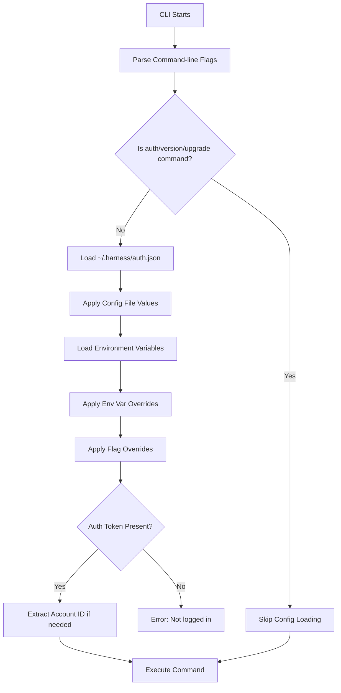

Harness CLI uses a combination of configuration files, environment variables, and command-line flags to manage settings. Understanding the configuration hierarchy helps you control CLI behavior effectively.

## Configuration Structure

The CLI maintains global configuration that applies to all commands:

```go
type GlobalFlags struct {
    APIBaseURL string
    AuthToken  string
    AccountID  string
    OrgID      string
    ProjectID  string
    Format     string
}
```

## Configuration File Location

Authentication and default settings are stored in:

```
~/.harness/auth.json
```

The directory is created automatically with `0755` permissions when you first run `hc auth login`.

### Configuration File Format

<CodeGroup>
```json Full Configuration
{
  "base_url": "https://app.harness.io",
  "token": "pat.account_id.random.random",
  "account_id": "my_account",
  "org_id": "my_org",
  "project_id": "my_project"
}
```

```json Minimal Configuration
{
  "base_url": "https://app.harness.io",
  "token": "pat.account_id.random.random",
  "account_id": "my_account"
}
```
</CodeGroup>

<Note>
  The `org_id` and `project_id` fields are optional. If not specified, you can provide them via flags or environment variables when needed.
</Note>

## Configuration Precedence

Configuration values are loaded in this order (later sources override earlier ones):

<Steps>
  <Step title="Default Values">
    Hard-coded defaults in the application
    - API URL: `https://app.harness.io`
    - Format: `table`
  </Step>
  
  <Step title="Configuration File">
    Values from `~/.harness/auth.json`
  </Step>
  
  <Step title="Environment Variables">
    Environment variables override config file values
  </Step>
  
  <Step title="Command-line Flags">
    Flags have the highest precedence and override everything
  </Step>
</Steps>

### Precedence Example

Given this configuration file:
```json ~/.harness/auth.json
{
  "base_url": "https://app.harness.io",
  "account_id": "default_account",
  "org_id": "default_org"
}
```

And these environment variables:
```bash
export HARNESS_ORG_ID="env_org"
export HARNESS_PROJECT_ID="env_project"
```

This command:
```bash
hc registry list --account override_account
```

Will use:
- `account_id`: `override_account` (from flag)
- `org_id`: `env_org` (from environment)
- `project_id`: `env_project` (from environment)
- `base_url`: `https://app.harness.io` (from config file)

## Global Flags

These flags are available on all commands (except `auth`, `version`, and `upgrade`):

| Flag | Type | Description | Default |
|------|------|-------------|----------|
| `--api-url` | string | Base URL for the API | `https://app.harness.io` |
| `--token` | string | Authentication token | - |
| `--account` | string | Account identifier | - |
| `--org` | string | Organization identifier | - |
| `--project` | string | Project identifier | - |
| `--format` | string | Output format (`table` or `json`) | `table` |
| `--verbose`, `-v` | boolean | Enable verbose logging | `false` |

### Flag Binding

The CLI binds persistent flags directly to the global configuration:

```go
rootCmd.PersistentFlags().StringVar(&config.Global.APIBaseURL, "api-url", "",
    "Base URL for the API (overrides saved config)")
rootCmd.PersistentFlags().StringVar(&config.Global.AuthToken, "token", "",
    "Authentication token (overrides saved config)")
rootCmd.PersistentFlags().StringVar(&config.Global.AccountID, "account", "", 
    "Account (overrides saved config)")
rootCmd.PersistentFlags().StringVar(&config.Global.OrgID, "org", "", 
    "Org (overrides saved config)")
rootCmd.PersistentFlags().StringVar(&config.Global.ProjectID, "project", "", 
    "Project (overrides saved config)")
rootCmd.PersistentFlags().StringVar(&config.Global.Format, "format", "table", 
    "Format of the result")
```

## Environment Variables

The CLI checks these environment variables during startup:

### Core Configuration

<Tabs>
  <Tab title="API Configuration">
    ```bash
    # Override API endpoint
    export HARNESS_API_URL="https://app.harness.io"
    
    # Use a different environment
    export HARNESS_API_URL="https://app.eu.harness.io"
    ```
  </Tab>
  
  <Tab title="Authentication">
    ```bash
    # Provide API key via environment
    export HARNESS_API_KEY="pat.account.xxx.xxx"
    ```
  </Tab>
  
  <Tab title="Scope">
    ```bash
    # Set organization context
    export HARNESS_ORG_ID="my_org"
    
    # Set project context
    export HARNESS_PROJECT_ID="my_project"
    ```
  </Tab>
</Tabs>

### Environment Variable Loading

The CLI loads environment variables after the config file:

```go
// Check environment variables (override auth config, flags will override during Execute)
if envVal := os.Getenv("HARNESS_API_URL"); envVal != "" {
    config.Global.APIBaseURL = envVal
}
if envVal := os.Getenv("HARNESS_API_KEY"); envVal != "" {
    config.Global.AuthToken = envVal
}
if envVal := os.Getenv("HARNESS_ORG_ID"); envVal != "" {
    config.Global.OrgID = envVal
}
if envVal := os.Getenv("HARNESS_PROJECT_ID"); envVal != "" {
    config.Global.ProjectID = envVal
}
```

## Scope Configuration

Harness resources are organized hierarchically:

```
Account
  └── Organization
        └── Project
              └── Resources (Registries, Pipelines, etc.)
```

### Account-level Resources

For account-level operations, only `account_id` is required:

```bash
hc registry list --account my_account
```

### Organization-level Resources

For org-level operations, provide both `account_id` and `org_id`:

```bash
hc registry list --account my_account --org my_org
```

### Project-level Resources

For project-level operations, provide all three identifiers:

```bash
hc registry list \
  --account my_account \
  --org my_org \
  --project my_project
```

<Note>
  You can save default scope in the config file during `hc auth login` to avoid repeating these flags.
</Note>

## Output Format Configuration

Control output format globally or per-command:

### Global Setting

```bash
# Set default format in config file
hc auth login  # During setup, or edit ~/.harness/auth.json

# Use environment variable
export HARNESS_FORMAT="json"

# Use flag on every command
hc registry list --format json
```

### Format Options

<CardGroup cols={2}>
  <Card title="Table Format" icon="table">
    Human-readable boxed tables (default)
    ```bash
    --format table
    ```
  </Card>
  
  <Card title="JSON Format" icon="code">
    Machine-readable JSON output
    ```bash
    --format json
    ```
  </Card>
</CardGroup>

See [Output Formats](/concepts/output-formats) for detailed examples.

## Configuration Loading Flow



## Configuration for Different Environments

<Tabs>
  <Tab title="Development">
    ```bash
    # Set up for development environment
    export HARNESS_API_URL="https://app.dev.harness.io"
    export HARNESS_API_KEY="$DEV_TOKEN"
    
    hc registry list
    ```
  </Tab>
  
  <Tab title="Production">
    ```bash
    # Set up for production environment
    export HARNESS_API_URL="https://app.harness.io"
    export HARNESS_API_KEY="$PROD_TOKEN"
    
    hc registry list
    ```
  </Tab>
  
  <Tab title="Europe">
    ```bash
    # Set up for European instance
    export HARNESS_API_URL="https://app.eu.harness.io"
    export HARNESS_API_KEY="$EU_TOKEN"
    
    hc registry list
    ```
  </Tab>
</Tabs>

## Verbose Logging

Enable detailed logging for troubleshooting:

```bash
hc registry list --verbose
```

When verbose mode is enabled:
- Logs are written to stderr in console format
- HTTP requests and responses are logged
- Timestamps are included (RFC3339 format)
- Errors include stack traces

The logging implementation:

```go
if verbose {
    logWriter := zerolog.ConsoleWriter{
        Out:        os.Stderr,
        TimeFormat: time.RFC3339,
        NoColor:    false,
    }
    log.Logger = log.Output(logWriter)
} else {
    // Disable logging when verbose is not enabled
    log.Logger = zerolog.Nop()
}
```

## Command-specific Configuration

Some commands have additional configuration stored in the global config:

```go
type GlobalFlags struct {
    // ... common flags ...
    
    // Command-specific configurations
    Registry RegistryConfig
}

type RegistryConfig struct {
    PkgURL string
    Migrate MigrateConfig
    Status StatusConfig
}
```

These are typically set via command-specific flags.

## Best Practices

<CardGroup cols={2}>
  <Card title="Use Config File for Defaults" icon="file">
    Save your most common settings in `~/.harness/auth.json` to avoid repetitive flags.
  </Card>
  
  <Card title="Use Environment Variables for CI/CD" icon="server">
    Set credentials and settings via environment variables in automated pipelines.
  </Card>
  
  <Card title="Use Flags for Overrides" icon="flag">
    Use command-line flags when you need to temporarily override settings.
  </Card>
  
  <Card title="Separate Environments" icon="layer-group">
    Use different environment variable sets or config files for different Harness environments.
  </Card>
</CardGroup>

## Troubleshooting

<AccordionGroup>
  <Accordion title="Which configuration is being used?">
    Run any command with `--verbose` to see the configuration values being used:
    ```bash
    hc registry list --verbose
    ```
  </Accordion>

  <Accordion title="Configuration file not found">
    If the config file doesn't exist, run:
    ```bash
    hc auth login
    ```
    This creates `~/.harness/auth.json` with your credentials.
  </Accordion>

  <Accordion title="Settings not taking effect">
    Remember the precedence order:
    1. Flags (highest)
    2. Environment variables
    3. Config file
    4. Defaults (lowest)
    
    Check if a higher-precedence source is overriding your setting.
  </Accordion>

  <Accordion title="How to reset configuration?">
    Remove the configuration file:
    ```bash
    rm ~/.harness/auth.json
    ```
    Then run `hc auth login` to create a fresh configuration.
  </Accordion>
</AccordionGroup>
